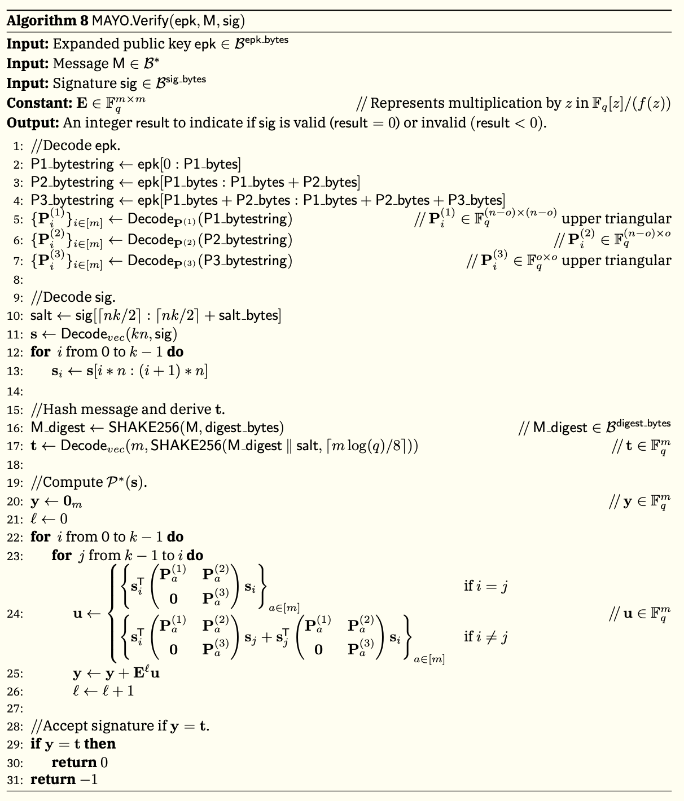
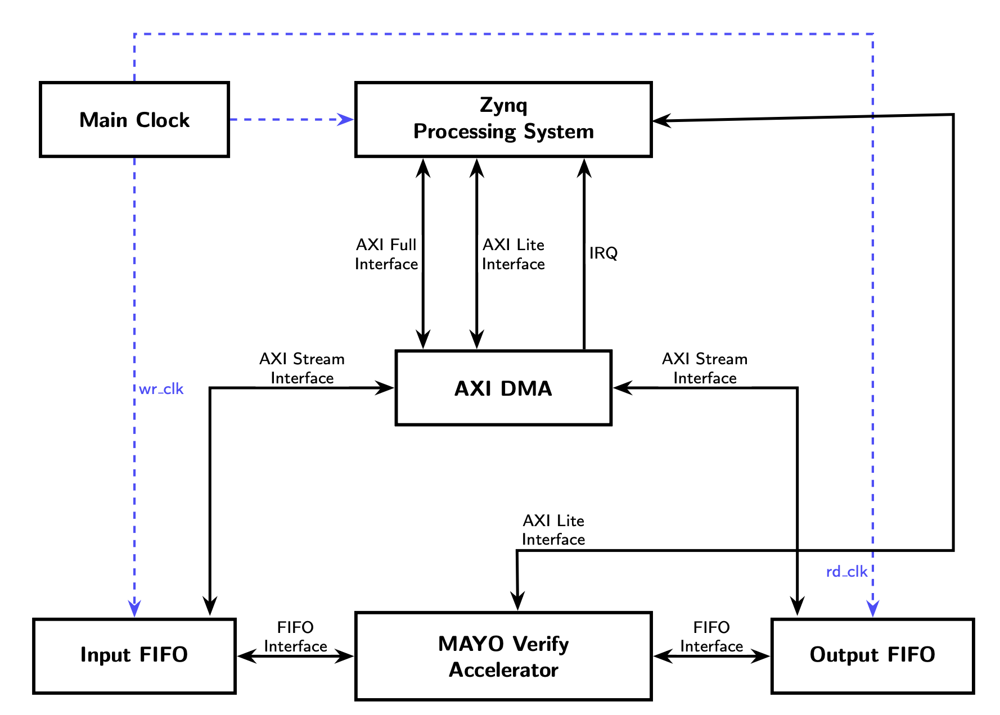
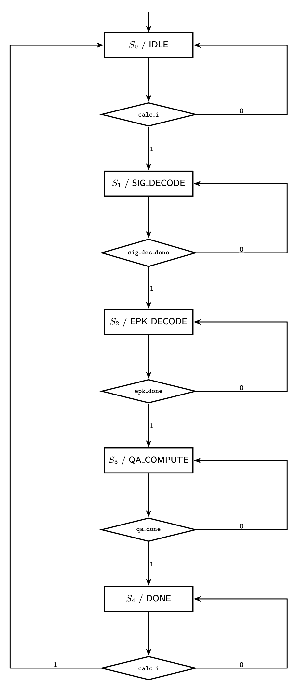
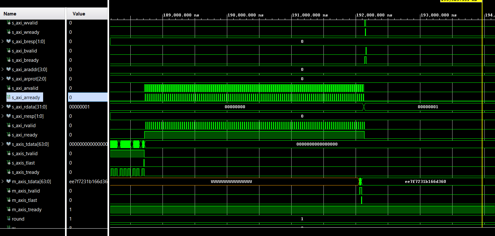
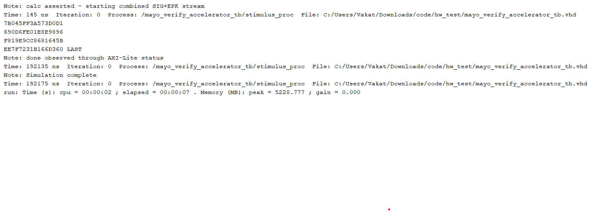
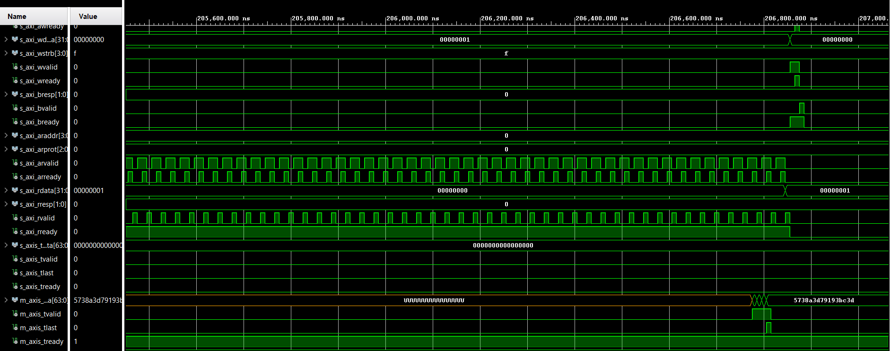
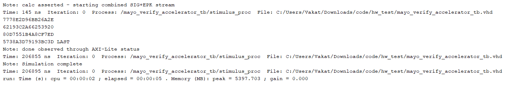

# Hardware/Software Co-Design for MAYO Verification

## Table of Contents
1. [Project Overview](#1-project-overview)
2. [Background & Importance](#2-background--importance)
3. [Folder Structure](#3-folder-structure)
4. [Algorithm & Parameters](#4-algorithm--parameters)
5. [Hardware Architecture](#5-hardware-architecture)
6. [Software Architecture](#6-software-architecture)
7. [How to Run](#7-how-to-run)
8. [Generating KAT Files](#8-generating-kat-files)
9. [Results](#9-results)
10. [Communication Protocols](#10-communication-protocols)

---

## 1. Project Overview

This project implements an **FPGA-based hardware accelerator for verifying MAYO post-quantum digital signatures**, targeting the Zybo Z7-10 (Zynq-7000) FPGA board. It supports both MAYO Round 1 and Round 2, Security Level 1 (Set 2) parameter instances.

The accelerator offloads the computationally intensive quadratic polynomial evaluation over GF(16) from the ARM processor to programmable logic, while the processor handles key expansion (AES-128-CTR) and target vector derivation (SHAKE256).

**Design Flow**:
```
[Host PC]
    │  UART (MSG + CPK + SIG)
    ▼
[Zynq PS — ARM Cortex-A9]
    │  mayo_expand_pk()  →  EPK  (AES-128-CTR)
    │  deriveT()         →  T    (SHAKE256)
    │  DMA transfer      →  SIG + EPK
    ▼
[Zynq PL — FPGA Fabric]
    │  sig_decoder   →  s vectors
    │  epk_decoder   →  P1, P2, P3 matrices
    │  quad_accumulator  →  Y = sᵀ·P·s in GF(16)
    ▼
[Zynq PS — Result Check]
    Y == T  →  SIGNATURE VALID / INVALID
    │  UART
    ▼
[Host PC]
```

---

## 2. Background & Importance

### Post-Quantum Cryptography

Classical public-key cryptography (RSA, ECDSA) relies on the computational hardness of problems like **integer factorization** and **discrete logarithms**. Quantum computers, running algorithms such as Shor's, can solve these problems efficiently — breaking the foundations of today's encryption.

**Post-Quantum Cryptography (PQC)** addresses this threat by designing cryptographic systems that remain secure even as quantum computers become practical. The NIST PQC standardization process is selecting new algorithms resistant to quantum attacks. **MAYO** is one such candidate.

### What is MAYO?

MAYO is a **multivariate quadratic (MQ) signature scheme** based on the hardness of solving systems of multivariate polynomial equations over finite fields — a problem believed to be hard even for quantum computers.

Signature verification requires evaluating a set of quadratic polynomials over **GF(16)** (Galois Field with 16 elements). The core computation accumulates:

```
y ∈ GF(16)ᵐ
Pₐ ∈ GF(16)ⁿˣⁿ
sᵢ ∈ GF(16)ⁿˣ¹

for i = 0 to k−1:
  for j = i to k−1:
    y ← y + (sᵢᵀ · Pₐ · sᵢ)      for all a ∈ [m]
```

**Variable dimensions:**

| Variable | Dimension | Description |
|----------|-----------|-------------|
| sᵢ | GF(16)ⁿ | Signature vector i, for i = 0..k−1 |
| Pₐ | GF(16)ⁿˣⁿ | Public key matrix for equation a, block-structured (see below) |
| uₐ | GF(16)ᵐ | Per-pair quadratic evaluation result (one scalar per equation) |
| y | GF(16)ᵐ | Accumulated output, compared against target T |

The public key matrix Pₐ has the following block structure (P1, P2, P3 from the EPK):

```
Pₐ = [ P1ₐ  P2ₐ ]   ∈ GF(16)ⁿˣⁿ
     [  0   P3ₐ ]

  P1ₐ  ∈ GF(16)⁽ⁿ⁻ᵒ⁾ˣ⁽ⁿ⁻ᵒ⁾   upper triangular   (vinegar variables)
  P2ₐ  ∈ GF(16)⁽ⁿ⁻ᵒ⁾ˣᵒ
  P3ₐ  ∈ GF(16)ᵒˣᵒ   upper triangular   (o = oil variables)
```

The result `y` is compared against a target vector `T` derived from the message hash. A signature is valid if `y == T`.

### Why an FPGA Accelerator?

- The EPK (expanded public key) is up to **106 KB** — loading and evaluating it in software is slow
- GF(16) arithmetic is naturally parallelizable in hardware (nibble-level operations)
- Embedded targets (e.g., IoT, smart cards) need fast, low-power verification
- The Zynq platform allows tight PS/PL integration via AXI and DMA

---

## 3. Folder Structure

```
code/
├── bd/                         # Block design documentation
│   └── block_design.pdf        # Vivado block design schematic (PS + PL)
│
├── gen_kat/                    # KAT file generation tools
│   ├── gen_mayo_r1_kat.c       # C program for Round 1 KAT generation
│   └── gen_mayo_r2_kat.sage    # SageMath script for Round 2 KAT generation
│
├── hardware/                   # VHDL implementation (20 files)
│   ├── mayo_pkg.vhd            # Package: parameters, types, lookup tables
│   ├── mayo_verify.vhd         # Top-level controller FSM
│   ├── mayo_verify_accelerator.vhd  # AXI-Lite/Stream wrapper
│   ├── sig_decoder.vhd         # Signature unpacking state machine
│   ├── epk_decoder.vhd         # Expanded public key decoder (top)
│   ├── epk_decoder_controller.vhd   # EPK decoder FSM
│   ├── epk_decoder_datapath.vhd     # EPK decoder datapath
│   ├── quad_accumulator.vhd    # Quadratic accumulator (top)
│   ├── quad_accumulator_controller.vhd
│   ├── quad_accumulator_datapath.vhd
│   ├── data_storage.vhd        # Multi-bank RAM + XOR reduction tree
│   ├── mul_gf16.vhd            # Single GF(16) multiplier
│   ├── mul_gf16_array.vhd      # Parallel GF(16) multiplier array
│   ├── decode_vector.vhd       # Nibble vector decoding
│   ├── reduce_mod_fx.vhd       # GF(16) polynomial modular reduction
│   ├── bit_sliced_vector.vhd   # Bit-sliced vector operations
│   ├── bit_sliced_unit.vhd     # Single bit-sliced unit
│   ├── reverse_reg.vhd         # Nibble/byte endianness reversal
│   ├── SIPO_FIFO.vhd           # Serial-In Parallel-Out FIFO
│   └── sdp_ram.vhd             # Simple dual-port block RAM wrapper
│
├── hw_test/                    # VHDL simulation testbenches
│   ├── mayo_verify_tb.vhd      # Top-level hardware testbench
│   ├── mayo_verify_accelerator_tb.vhd  # AXI accelerator testbench
│   └── mayo_tb_pkg.vhd         # Testbench helpers (file I/O, stimulus)
│
├── kat/                        # Known Answer Test vectors
│   ├── KAT_R1_S2.kat           # Round 1, Security Level 1 (Set 2) test cases
│   └── KAT_R2_S2.kat           # Round 2, Security Level 1 (Set 2) test cases
│
├── logs/                       # Captured test outputs
│   ├── mayo_verify_accelerator_r1_log.txt  # Hardware test log (R1)
│   ├── mayo_verify_accelerator_r2_log.txt  # Hardware test log (R2)
│   ├── test_mayo_verify_r1_log.txt          # Embedded SW test log (R1)
│   ├── test_mayo_verify_tmr_log.txt         # TMR variant log with timing
│   ├── behavsim_waveform_r1.png             # Simulation waveforms (R1)
│   ├── behavsim_waveform_r2.png             # Simulation waveforms (R2)
│   └── ...
│
├── reports/                    # Vivado synthesis & implementation reports
│   ├── mayo_verify_r1_util_report.txt    # FPGA resource utilization (R1)
│   ├── mayo_verify_r1_timing_summary.txt # Static timing analysis (R1)
│   ├── mayo_verify_r2_util_report.txt    # FPGA resource utilization (R2)
│   ├── mayo_verify_r2_timing_summary.txt # Static timing analysis (R2)
│   └── *.png                             # Utilization / timing graphs
│
├── slides/                     # Project presentation slides
│   ├── proposal.pdf            # Project proposal presentation
│   └── update.pdf             # Progress update presentation
│
├── scripts/                    # Host-side utilities
│   └── kat_uart_transfer.py    # Python: send KAT cases to device via UART
│
├── software/                   # Embedded C application & drivers
│   ├── mayo_helper.h / .c      # MAYO parameters, expand_pk, deriveT
│   ├── mayo_verify_accelerator.c  # Main application (PS side)
│   ├── mayo_ctrl.h             # Hardware register map definitions
│   ├── dma_helper.h / .c       # AXI DMA scatter-gather driver
│   ├── uart_helper.h / .c      # UART framing driver
│   ├── fips202.h / .c          # SHAKE256 (FIPS 202)
│   ├── aes.h / aes_c.c         # AES-128-CTR for key expansion
│   └── test/                   # Host-side smoke tests
│       ├── test_mayo_verify_support.c   # Tests expand_pk + deriveT vs KAT
│       └── mayo_verify_kat.c            # KAT verification harness
│
├── sw_test/                    # Embedded-only software tests
│   ├── test_mayo_verify.c      # Verification test (KAT header mode)
│   ├── test_mayo_verify_tmr.c  # Triple Modular Redundancy variant
│   ├── test_mayo_helper.c      # Unit tests for helper functions
│   ├── test_vector_epk_t.c     # EPK expansion test
│   ├── test_vector_epk_t_zybo.c  # Zybo board variant
│   ├── test_vectors_zybo_r1.h  # Compiled-in R1 test vectors
│   └── test_vectors_zybo_r2.h  # Compiled-in R2 test vectors
│
├── vectors/                    # Plain-text hex test vectors (for VHDL sim)
│   ├── input_gen_r1_msg_mayo_2_test.txt
│   ├── input_gen_r1_sig_mayo_2_test.txt
│   ├── input_gen_r1_epk_mayo_2_test.txt
│   ├── input_gen_r1_cpk_mayo_2_test.txt
│   ├── input_gen_r2_msg_mayo_2_test.txt
│   ├── input_gen_r2_sig_mayo_2_test.txt
│   ├── input_gen_r2_epk_mayo_2_test.txt
│   └── input_gen_r2_cpk_mayo_2_test.txt
│
└── xsa/                        # Xilinx System Archive (bitstream + metadata)
    ├── mayo_verify_r1.xsa                  # Round 1 bitstream
    ├── mayo_verify_r2.xsa                  # Round 2 bitstream
    └── mayo_verify_r1_with_axi_timer.xsa   # Round 1 + AXI Timer (profiling)
```

---

## 4. Algorithm & Parameters



This project uses MAYO at **Security Level 1 (Set 2)**. Both Set 1 and Set 2 target security level 1 and represent alternative parameter choices within that security level. Two round variants are supported in synthesis level:

| Parameter       | Round 1 (R1 S2) | Round 2 (R2 S2) | Description                          |
|-----------------|-----------------|-----------------|--------------------------------------|
| `m`             | 64              | 64              | Number of equations / GF(16) outputs |
| `n`             | 78              | 81              | Number of variables                  |
| `o`             | 18              | 17              | Number of oil variables              |
| `k`             | 4               | 4               | Number of signature vectors          |
| `d = n - o`     | 60              | 64              | Number of vinegar variables          |
| `cpk_bytes`     | 5,488 B         | 4,912 B         | Compact public key size              |
| `epk_bytes`     | 98,592 B        | 106,272 B       | Expanded public key size             |
| `sig_bytes`     | 180 B           | 186 B           | Signature size (includes 24 B salt)  |
| `salt_bytes`    | 24 B            | 24 B            | Salt embedded in signature tail      |
| `digest_bytes`  | 32 B            | 32 B            | SHAKE256 digest length               |

### Verification Steps

1. **Expand CPK → EPK**: Use the 16-byte `pk_seed` in CPK to derive P1 and P2 matrices via AES-128-CTR. Copy P3 verbatim.
2. **Derive target T**: `T = decode_vec(SHAKE256(SHAKE256(msg) || salt, m_bytes))`, where `salt` is the last 24 bytes of the signature.
3. **Evaluate Y**: Hardware computes `Y = sᵀ·P·s` over GF(16), where `s` vectors are decoded from the signature.
4. **Compare**: If `Y == T`, the signature is valid.

---

## 5. Hardware Architecture



### Top-Level FSM ([`mayo_verify.vhd`](hardware/mayo_verify.vhd))



### AXI Wrapper ([`mayo_verify_accelerator.vhd`](hardware/mayo_verify_accelerator.vhd))

- **AXI-Lite Slave** (control): offset `0x00` — bit 0 starts computation; STATUS_DONE is read-back
- **AXI Stream Slave** (input): receives `SIG || EPK` stream from DMA
- **AXI Stream Master** (output): emits Y result back via DMA

### Key Modules

| Module | Function |
|--------|----------|
| `sig_decoder` | Unpacks k compressed signature vectors (nibble alignment, shift/load ROM) |
| `epk_decoder` | Reads P1, P2, P3 from stream; stores into RAM banks |
| `quad_accumulator` | Computes Y = sᵀ·P·s via GF(16) multipliers and XOR accumulators |
| `data_storage` | Multi-bank dual-port RAM with XOR reduction tree |
| `mul_gf16` | Combinational GF(16) multiplier using irreducible polynomial x⁴+x+1 |
| `reduce_mod_fx` | Polynomial modular reduction for GF(16) |
| `reverse_reg` | Nibble/byte reversal for endianness correction |
| `sdp_ram` | Xilinx simple dual-port block RAM primitive |

### AXI DMA Input Format

```
[SIG — 156 B (R1) or 162 B (R2), zero-padded to 8-byte boundary]
[EPK — 98,592 B (R1) or 106,272 B (R2)]
```

---

## 6. Software Architecture

### Libraries Used

| Header | Purpose |
|--------|---------|
| [`fips202.h`](software/fips202.h) | SHAKE256 — message hashing and target vector derivation |
| [`aes.h`](software/aes.h) | AES-128-CTR — compact public key expansion (EPK generation) |
| [`mayo_helper.h`](software/mayo_helper.h) | `expand_pk`, `deriveT`, MAYO parameter structs |
| [`mayo_ctrl.h`](software/mayo_ctrl.h) | AXI-Lite control register map (`START`, `STATUS_DONE`) |
| [`dma_helper.h`](software/dma_helper.h) | DMA transfer wrappers (send/receive byte buffers) |
| [`uart_helper.h`](software/uart_helper.h) | UART framing — length-prefixed field send/receive |

---

### [`mayo_helper.c`](software/mayo_helper.c) — Core Crypto Functions

```c
// Expand compact public key to full expanded key
int mayo_expand_pk(const mayo_params_t *p,
                   const unsigned char *cpk,   // input:  cpk_bytes
                   unsigned char *epk);         // output: epk_bytes

// Derive target vector from message + signature
int deriveT(const mayo_params_t *p,
            const unsigned char *m, unsigned long long mlen,
            const unsigned char *sig,           // used only for salt extraction
            unsigned char *t);                  // output: m_bytes
```

### [`mayo_verify_accelerator.c`](software/mayo_verify_accelerator.c) — Main Application

Runs on the ARM Cortex-A9 (Zynq PS). Execution loop:

1. Initialize UART and DMA
2. Synchronize with host (`"UART Synchronized"`)
3. For each test case:
   - Receive MSG, CPK, SIG over UART (length-prefixed fields)
   - `mayo_expand_pk()` → EPK
   - `deriveT()` → T
   - DMA-send `SIG || EPK` to accelerator
   - Poll `STATUS_DONE` bit via AXI-Lite
   - DMA-receive Y from accelerator
   - Compare Y with T → send `0x01` (PASS) or `0x00` (FAIL) to host

---

## 7. How to Run

### Prerequisites

| Tool / Platform | Purpose |
|-----------------|---------|
| Xilinx Vivado v2024+ | FPGA synthesis, implementation, bitstream |
| Xilinx Vitis v2024+ | ARM cross-compilation, ELF loading |
| Python 3 + pyserial | UART test runner |
| SageMath | Round 2 KAT generation |
| GCC (host) | Compile host-side smoke tests |

---

### A. VHDL Behavioral Simulation (Vivado)

1. Open Vivado and create a new RTL project targeting the **Zybo Z7-10** board
2. Add all files from `hardware/` as VHDL design sources
3. Add `hw_test/mayo_tb_pkg.vhd` and `hw_test/mayo_verify_tb.vhd` as simulation sources
4. Add the test vectors from `vectors/` as simulation sources (or ensure the testbench file path points to them)
5. In **Flow Navigator**, click **Run Simulation → Run Behavioral Simulation**
6. In the testbench generic settings, select **Round 1** or **Round 2** as required
7. Click **Run All** — the testbench reads from `vectors/input_gen_r*_*_mayo_2_test.txt`, drives the accelerator, and prints the Y output to the simulation console

---

### B. FPGA Bitstream (Vivado)

Pre-built XSA files are provided in `xsa/`. To re-synthesize:

1. Open Vivado and create a new RTL project targeting the **Zybo Z7-10** board
2. Add all files from `hardware/` as VHDL design sources
3. Package the accelerator as a custom IP (**Tools → Create and Package New IP**)
4. Create a new block design — add the custom IP, Zynq PS block, AXI DMA, interconnects, and any other required IPs using [`bd/block_design.pdf`](bd/block_design.pdf) as reference
5. Run **Synthesis → Implementation → Generate Bitstream**
6. Export hardware including bitstream (**File → Export → Export Hardware**) to produce the XSA file for Vitis

To use the pre-built bitstreams directly, use the provided XSA files:
- [`xsa/mayo_verify_r1.xsa`](xsa/mayo_verify_r1.xsa) — Round 1
- [`xsa/mayo_verify_r2.xsa`](xsa/mayo_verify_r2.xsa) — Round 2
- [`xsa/mayo_verify_r1_with_axi_timer.xsa`](xsa/mayo_verify_r1_with_axi_timer.xsa) — Round 1 with AXI Timer for profiling

---

### C. Embedded Software (Vitis / Xilinx SDK)

1. Create a new Vitis platform from the XSA file
2. Create a new application project
3. Add all files from `software/` as source
4. Build and load the ELF onto the Zynq board via JTAG

---

### D. Run KAT Tests via UART (Python)

Connect the Zybo Z7-10 board to the host PC via USB-UART, then run:

```bash
cd scripts/
python3 kat_uart_transfer.py --port COM6 --kat ../kat/KAT_R2_S2.kat
```

**Arguments:**

| Argument | Default | Description |
|----------|---------|-------------|
| `--port` | `COM5` | Serial port of the device (Linux: `/dev/ttyUSB0`) |
| `--kat`  | `../kat/KAT_R2_S2.kat` | Path to the `.kat` test vector file |

Expected output:
```
Parsing: ../kat/KAT_R2_S2.kat
  10 test cases found.

Opening COM6 @ 115200 baud...
Waiting for device synchronization...
UART Synchronized

------------------------------------------------------------
Case #1
    Sent  MSG             64 bytes  [076CA79692BD38E709...]
    Sent  CPK           4912 bytes  [8CCF455B646D1EFE88...]
    Sent  SIGNATURE      186 bytes  [091B591C29C94972B4...]
  PASS  device=SIGNATURE VALID  expected=SIGNATURE VALID
...
```

---

### E. Additional Tests

Several other test files are available for verifying individual functions, on-board timing, and hardware interfaces:

**Software tests (`sw_test/`)**

| File | Purpose |
|------|---------|
| [`test_mayo_helper.c`](sw_test/test_mayo_helper.c) | Validates `mayo_expand_pk` and `deriveT` against KAT vectors on the host |
| [`test_vector_epk_t.c`](sw_test/test_vector_epk_t.c) | Computes and prints EPK and T from a given CPK/MSG/SIG on the host |
| [`test_vector_epk_t_zybo.c`](sw_test/test_vector_epk_t_zybo.c) | Same as above but runs on the Zybo — receives inputs over UART, computes EPK and T on the ARM core, and sends back a result byte |
| [`test_mayo_verify.c`](sw_test/test_mayo_verify.c) | End-to-end verify test on the Zybo using the hardware accelerator |
| [`test_mayo_verify_tmr.c`](sw_test/test_mayo_verify_tmr.c) | Same as above with an AXI Timer enabled — profiles each phase (`mayo_expand_pk`, `deriveT`, DMA TX, HW compute) and prints a timing summary |

**Hardware testbench (`hw_test/`)**

| File | Purpose |
|------|---------|
| [`mayo_verify_accelerator_tb.vhd`](hw_test/mayo_verify_accelerator_tb.vhd) | Simulates the full AXI-Lite and AXI Stream interfaces of the accelerator wrapper — useful for verifying control register behaviour, stream handshaking, and DMA signalling before running on hardware |

---

## 8. Generating KAT Files

KAT (Known Answer Test) files contain signed message/key/signature triples used to validate the implementation.

### KAT File Format

```
# Case 1
LENGTH=64
MSG=076CA79692BD38E709DE26DD246C0D75...
CSK=8E8AF47F07CDFBBE73CD2DA09E22A327...
CPK=8CCF455B646D1EFE88BBE53AC2E8D2A2...
SIGNATURE=091B591C29C94972B4305645...

# Case 2
...
```

| Field | Description |
|-------|-------------|
| `LENGTH` | Message length in bytes |
| `MSG` | Hex-encoded message |
| `CSK` | Compact secret key (used for signing only, not verified) |
| `CPK` | Compact public key |
| `SIGNATURE` | Signature bytes |

---

### Round 1 KAT — C program

Requires the **MAYO Round 1 C reference implementation** (provides `mayo.h`, `rng.h`, and associated source files). Obtain it from the official MAYO submission package and build it using CMake, then compile `gen_mayo_r1_kat.c` against the resulting library and headers.

The CMake build produces a separate executable per parameter set (e.g. `gen_mayo_r1_kat_mayo_2`). Run it with `--limit` to generate KAT cases — it writes `KAT_R1_S{N}.kat` directly to the current directory:

```bash
./gen_mayo_r1_kat_mayo_2 --limit 10

mv KAT_R1_S2.kat ../kat/KAT_R1_S2.kat
```

**Command-line options:**

| Option | Default | Description |
|--------|---------|-------------|
| `--limit N` | 0 (required) | Number of test cases to generate |
| `--min-msg-len N` | 8 | Minimum message length in bytes |
| `--max-msg-len N` | 65535 | Maximum message length in bytes |

---

### Round 2 KAT — SageMath

Requires **SageMath** and the **MAYO Round 2 SageMath reference library** (`sagelib/mayo.py`). Obtain `sagelib/` from the MAYO Round 2 submission package and place it inside `gen_kat/`:

```
gen_kat/
├── gen_mayo_r2_kat.sage
└── sagelib/
    └── mayo.py
```

Then run:

```bash
cd gen_kat/

# Generate 10 cases for Security Level 1 (Set 2), Round 2
sage gen_mayo_r2_kat.sage --limit 10 --param mayo_2

# Generate 50 cases with short messages
sage gen_mayo_r2_kat.sage --limit 50 --param mayo_2 --min-msg-len 8 --max-msg-len 256

# Generate for all parameter sets
sage gen_mayo_r2_kat.sage --limit 10
```

Output is written to `KAT_R2_S{N}.kat` in the current directory. Move to `kat/` for use by tests:

```bash
mv KAT_R2_S2.kat ../kat/KAT_R2_S2.kat
```

**Command-line options**:

| Option | Default | Description |
|--------|---------|-------------|
| `--limit N` | 0 (required) | Number of test cases to generate |
| `--param` | all sets | Parameter set: `mayo_1`, `mayo_2`, `mayo_3`, `mayo_5` |
| `--min-msg-len N` | 8 | Minimum message length in bytes |
| `--max-msg-len N` | 65535 | Maximum message length in bytes |

---

## 9. Results

| Log File | Description | Result |
|----------|-------------|--------|
| [`mayo_verify_accelerator_r1_log.txt`](logs/mayo_verify_accelerator_r1_log.txt) | R1 hardware KAT test via UART (Python script → Zybo) | 10/10 PASS |
| [`mayo_verify_accelerator_r2_log.txt`](logs/mayo_verify_accelerator_r2_log.txt) | R2 hardware KAT test via UART (Python script → Zybo) | 10/10 PASS |
| [`test_mayo_verify_r1_log.txt`](logs/test_mayo_verify_r1_log.txt) | R1 embedded software test on Zybo (KAT header mode) | PASS |
| [`test_mayo_verify_r2_log.txt`](logs/test_mayo_verify_r2_log.txt) | R2 embedded software test on Zybo (KAT header mode) | PASS |
| [`test_mayo_verify_tmr_log.txt`](logs/test_mayo_verify_tmr_log.txt) | R1 with AXI Timer — end-to-end timing profile | PASS |

Full logs are in `logs/`.

---

### FPGA Resource Utilization (Vivado 2025.2, Zybo Z7-10)

| Resource | R1 Used | R2 Used | Available | Util% (R1 / R2) |
|----------|---------|---------|-----------|-----------------|
| Slice LUTs | 15,169 | 15,748 | 17,600 | 86.2% / 89.5% |
| Slice Registers | 10,795 | 10,926 | 35,200 | 30.7% / 31.0% |
| Block RAM Tiles | 23 | 23 | 60 | 38.3% / 38.3% |

> LUT utilization is near-capacity. Round 2 is slightly higher due to the larger vinegar variable count (d=64 vs d=60). The Zybo Z7-10 is the minimum viable device for this design.

---

### Behavioral Simulation

**Round 1**





**Round 2**





---

### Timing Breakdown (Round 1, on-board profiling)

| Phase | Time | Notes |
|-------|------|-------|
| `mayo_expand_pk` | 73.9 ms | AES-128-CTR on ARM |
| `deriveT` | 0.17 ms | SHAKE256 on ARM |
| DMA TX (SIG+EPK) | 1,116.7 ms | Bottleneck — 99 KB over AXI DMA |
| Hardware compute | ~1.2 µs | Quad accumulator on PL |
| **Total** | **~1,191 ms** | |

The hardware accelerator itself is extremely fast (~1 µs). The dominant cost is DMA transfer of the large EPK. A potential optimization is a faster AXI DMA configuration. Computing EPK expansion in hardware would eliminate the transfer but requires implementing AES-128-CTR in the PL, which adds significant LUT and BRAM overhead — especially constrained on the Zybo Z7-10.

---

## 10. Communication Protocols

### UART Protocol (Host ↔ Device)

Fields are length-prefixed:

```
[2 bytes: big-endian length] [payload bytes]
```

Full exchange for one test case:

```
Host → Device:
  [0x?? 0x?? + MSG bytes]
  [0x?? 0x?? + CPK bytes]
  [0x00 0xB4 + SIG bytes]   (180 B for R1, 186 B for R2)

Device → Host:
  0x01   (SIGNATURE VALID)
  0x00   (SIGNATURE INVALID)

```

Synchronization: the device runs a continuous loop — it waits for the host to connect, sends `"UART Synchronized\n"`, processes all test cases, then returns to waiting. Each time the Python script is run, the device re-synchronizes and handles the next batch.

### AXI-Lite Register Map

| Offset | Name | Description |
|--------|------|-------------|
| `0x00` | Control/Status | bit 0: write `0x1` to start (`CTRL_CALC`), write `0x0` to stop (`CTRL_IDLE`); read back `0x1` when done (`STATUS_DONE`) |

### DMA Data Stream Format

```
Input stream (Host → Accelerator):
  Bytes 0 to (sig_payload_bytes-1) : Signature (padded to 8-byte boundary)
  Bytes sig_payload_bytes to end   : EPK (P1 || P2 || P3)

Output stream (Accelerator → Host):
  m_bytes (32 bytes) of Y, byte-reversed (corrected in software)
```

---

## Contributors

- Kowsyap Pranay Kumar Musumuri
